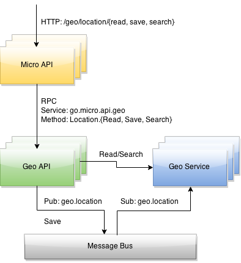

# Location API

The Location API provides a REST based api for saving and retrieving geo location data. In the future it 
may provide more feature rich data not provided directly by the location-srv service.



## Usage

Run api service
```
$ go run main.go 
I0514 23:18:27.880108   35822 rpc_server.go:156] Rpc handler /_rpc
I0514 23:18:27.880536   35822 server.go:90] Starting server go.micro.api.location id go.micro.api.location-2526ea49-fa87-11e4-a417-68a86d0d36b6
I0514 23:18:27.880648   35822 rpc_server.go:187] Listening on [::]:54907
I0514 23:18:27.880691   35822 server.go:76] Registering go.micro.api.location-2526ea49-fa87-11e4-a417-68a86d0d36b6
```

Run location service

```
$ location-srv
I0514 23:56:06.938578   36114 rpc_server.go:156] Rpc handler /_rpc
I0514 23:56:06.938845   36114 ingester.go:17] Starting topic geo.location subscriber
I0514 23:56:06.939094   36114 http_broker.go:69] Broker Listening on [::]:55539
I0514 23:56:06.939159   36114 http_broker.go:216] Registering subscriber broker-67a80af9-fa8c-11e4-9c34-68a86d0d36b6
I0514 23:56:06.955284   36114 server.go:90] Starting server go.micro.srv.location id go.micro.srv.location-67a7e16d-fa8c-11e4-9c34-68a86d0d36b6
I0514 23:56:06.955401   36114 rpc_server.go:187] Listening on [::]:55545
I0514 23:56:06.955434   36114 server.go:76] Registering go.micro.srv.location-67a7e16d-fa8c-11e4-9c34-68a86d0d36b6
```

Run the Micro API
```
$ micro api --handler=api
I0514 23:22:07.412956   35843 rpc_server.go:156] Rpc handler /_rpc
I0514 23:22:07.413273   35843 api.go:129] API Rpc handler /rpc
I0514 23:22:07.413416   35843 api.go:141] Listening on [::]:8080
I0514 23:22:07.413449   35843 server.go:90] Starting server go.micro.api id go.micro.api-a800f702-fa87-11e4-af97-68a86d0d36b6
I0514 23:22:07.413537   35843 rpc_server.go:187] Listening on [::]:54931
I0514 23:22:07.413586   35843 server.go:76] Registering go.micro.api-a800f702-fa87-11e4-af97-68a86d0d36b6
```

Test Service
```
$ go run location-api/examples/client_request.go
Saved entity: map[location:[{"latitude": 51.516509, "longitude": 0.124615}] id:[id123] type:[runner]]
Read entity: {"id":"id123","type":"runner","location":{"latitude":51.516509,"longitude":0.124615}}
Search results: [{"id":"id123","type":"runner","location":{"latitude":51.516509,"longitude":0.124615}}]
```
